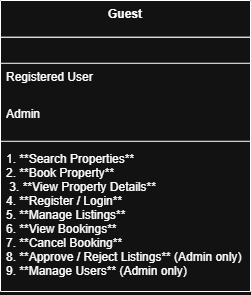

# 🧾 Requirement Analysis in Software Development

---

## 💡 Why is Requirement Analysis Important?

Requirement analysis is the **foundation** of successful software development.  
It ensures every feature, constraint, and expectation is understood before coding begins.

### 🔍 Key Reasons

- 🧠 **Clarity and Understanding:**  
  Helps teams and stakeholders reach a common understanding of what the software should deliver.

- 📏 **Scope Definition:**  
  Clearly outlines project boundaries to prevent scope creep.

- 🧱 **Basis for Design and Development:**  
  Provides a solid foundation for building and testing.

- 💰 **Cost and Time Estimation:**  
  Enables accurate resource planning and scheduling.

- ✅ **Quality Assurance:**  
  Ensures that the final product aligns with specified requirements and user expectations.

---

## ⚙️ Key Activities in Requirement Analysis

### 1️⃣ Requirement Gathering 🗂️
Collects **raw input** from stakeholders to understand needs and pain points.

- 🎙️ **Interviews:** One-on-one sessions to explore expectations.  
- 🧾 **Surveys / Questionnaires:** Broader outreach to capture diverse inputs.  
- 🤝 **Workshops:** Collaborative discussions for consensus.  
- 👀 **Observation:** Watching users in their environment to discover real-world challenges.  
- 📚 **Document Analysis:** Reviewing existing materials to extract useful data.

---

### 2️⃣ Requirement Elicitation ✍️
Transforms raw input into **actionable insights** and high-value requirements.

- 💡 **Brainstorming:** Generates creative ideas for potential features.  
- 🗣️ **Focus Groups:** Gathers collective feedback from target users.  
- 🧩 **Prototyping:** Builds quick visuals to validate user needs early.

---

### 3️⃣ Requirement Documentation 📘
Creates **structured records** that communicate system expectations clearly.

- 📄 **Software Requirement Specification (SRS):** Detailed list of all requirements.  
- 👤 **User Stories:** User-centered descriptions of desired functionality.  
- ⚙️ **Use Cases:** Diagrams that show how users interact with the system.

---

### 4️⃣ Requirement Analysis and Modeling 📊
Turns information into **logical structures** for better understanding.

- 📌 **Requirement Prioritization:** Sorting requirements by impact and urgency.  
- 🧮 **Feasibility Analysis:** Evaluating technical and financial practicality.  
- 🧠 **Modeling:** Creating diagrams (DFD, ERD, UML) to visualize data and processes.

---

### 5️⃣ Requirement Validation ✅
Ensures that requirements are **complete, accurate, and testable**.

- 🔎 **Review and Approval:** Getting stakeholder confirmation on all requirements.  
- 📋 **Acceptance Criteria:** Defining clear “done” conditions for each feature.  
- 🔗 **Traceability Matrix:** Mapping every requirement to its design and test coverage.

---

## 🧠 Types of Requirements

### ⚙️ Functional Requirements  
> Define **what the system should do.**

**Examples:**  
User authentication, property search, booking system, user registration.

**Key Functional Requirements:**
- 🔍 **Search Properties:** Filter by location, price, or availability.  
- 🧑‍💻 **User Registration:** Create and manage user accounts.  
- 🏡 **Property Listings:** Display details, pricing, and images.  
- 🗓️ **Booking System:** Book, view, and manage reservations.  
- 🔐 **User Authentication:** Secure login and registration.

---

### ⚡ Non-Functional Requirements  
> Define **how the system should perform.**

**Examples:** Performance, security, scalability, usability, reliability.

**Key Non-Functional Requirements:**
- ⚡ **Performance:** Pages load within 2 seconds; support 1,000+ users.  
- 🔒 **Security:** Data encryption, secure login, and safe transactions.  
- 🌐 **Scalability:** Expand to handle growth in users and data.  
- 🎨 **Usability:** Simple, intuitive interface with smooth navigation.  
- ♻️ **Reliability:** 99.9% uptime and fast recovery from failures.

---

## 🧩 Use Case Diagram

Here’s a visual overview of the system interactions:

---

## 🧾 Acceptance Criteria

**🎯 Objective:** Define measurable conditions to confirm a feature is complete.

### 📘 What is Acceptance Criteria?
Acceptance criteria are **specific conditions** a feature must meet to be approved by stakeholders.

### ✍️ How to Define Acceptance Criteria
- Be **specific**, **measurable**, and **testable**.  
- Include both **functional** and **non-functional** conditions.  
- **Example (Booking System):**  
  > Users can select available dates, confirm bookings, and receive a confirmation email within **2 minutes**.

### 🌟 Benefits of Acceptance Criteria
- Ensures **shared understanding** between teams and clients.  
- Provides a **basis for testing** and validation.  
- Promotes **high quality** and consistent outcomes.

---

## 🧭 Summary

Requirement Analysis lays the **blueprint for success** in software projects.  
It transforms ideas into structured, validated, and testable requirements —  
ensuring the final product is **usable, reliable, and truly aligned with user needs.**

> 💬 *“Measure twice, cut once — Requirement Analysis is that first measure.”*
